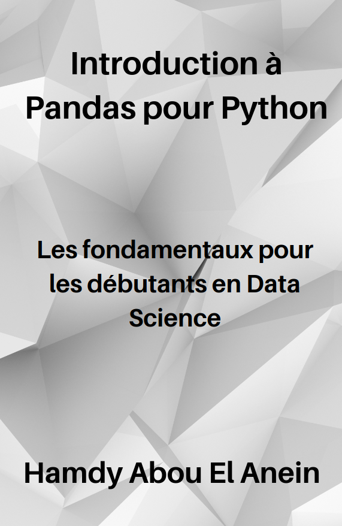

# Programmes du livre : [Introduction à Pandas pour Python : Les fondamentaux pour les débutants en Data Science](https://www.amazon.fr/dp/B0C2S4MZ88/ref=tmm_pap_swatch_0?_encoding=UTF8&qid=1682056247&sr=8-22)      
       

Auteur : [Hamdy Abou El Anein](https://www.amazon.fr/Hamdy-Abou-El-Anein/e/B0BM89T88X/ref=aufs_dp_fta_dsk)    

